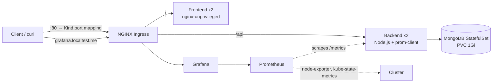

# Architecture

```mermaid
flowchart LR
  C[Client / curl] -->|:80 → Kind port mapping| I[NGINX Ingress]
  I -->|/| F[Frontend x2<br/>nginx-unprivileged]
  I -->|/api| B[Backend x2<br/>Node.js + prom-client]
  B --> M[(MongoDB StatefulSet<br/>PVC 1Gi)]
  P[Prometheus] -. scrapes /metrics .-> B
  P -. node-exporter, kube-state-metrics .-> K[Cluster]
  G[Grafana] --> P
  C -->|grafana.localtest.me| I
  I --> G
```

Namespaces: `three-tier` (app), `monitoring` (kube-prometheus-stack), `ingress-nginx`.
